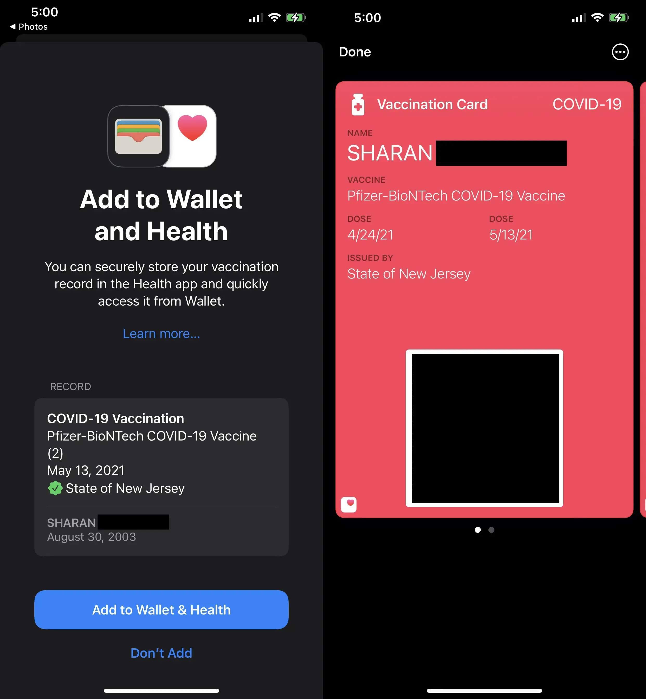
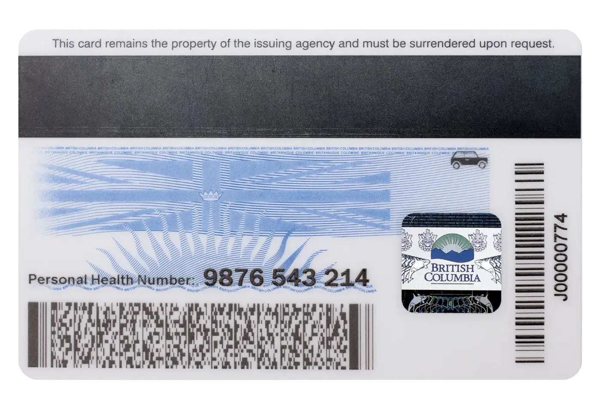

Really quick post here... so far, you've probably gotten a vaccine passport of some sort. If you live in a place where you need to show vaccine passports, you know that it's a hassle to find where you've stored the QR code on your phone and pull it up.

Recently, I found out that you're able to add your vaccine passport's QR code to Apple Pay and open it up really easily. This should work with any QR code-based vaccine proof. Make sure you use the one issued by your local health authority, since that's the one that businesses in your area will be able to verify.

## Adding to Apple Wallet

For this, make sure you're on **iOS 15.1 or later**.

Now, for the main part. Open up your proof of vaccination on a separate device (whether it be the federal PDF or BC's image) and scan the code using your iPhone. Like it shows in the screenshot below, it should open in the Health app.

Once you accept and click **Done**, you can access it the same way you do with Apple Pay. Double tap the power button and no matter whether your phone is turned off or in a different app, your vaccine card will pull up automatically.

The QR code might look really small on wallet, but I tried to verify it as though I'm a business using both [BC Vaccine Card Verifier](https://apps.apple.com/ca/app/bc-vaccine-card-verifier/id1583114791) and [Verify Ontario](https://apps.apple.com/ca/app/verify-ontario/id1584425317) (those are the apps that businesses use to verify your QR code), and both apps easily picked it up.

## Adding non-Canadian vaccine proof

I originally got my vaccine in the United States, and they gave me my original QR code (if you're from New Jersey like me, you can get it from [Docket](https://apps.apple.com/us/app/docket-organize-communicate/id1117444284)). It worked the same way with that, too:

Notice that the issuing authority says "State of New Jersey", not PHSA.

### Addendum for out-of-province folks

If you're coming from outside BC (like me), you'll first need to submit your foreign proof of vaccination to BC, and they'll add it to their database. To do this:

1. Go to [https://immunizationrecord.gov.bc.ca/](https://immunizationrecord.gov.bc.ca/) and click on **Update Now**.

2. Input your Personal Health Number (PHN). This will be on the back of your BC Services Card. If you don't have a PHN yet, call [+1-833-838-2323](tel:+1-833-838-2323) and they can create one for you.

3. Upload your proof of vaccination, and then click **Next** and fill out all the details. Once you're done, submit the form.

4. It will take roughly a week (at the time of writing) to process this information. Afterwards, you can go to [Health Gateway](https://www.healthgateway.gov.bc.ca/) to get your vaccine card.
