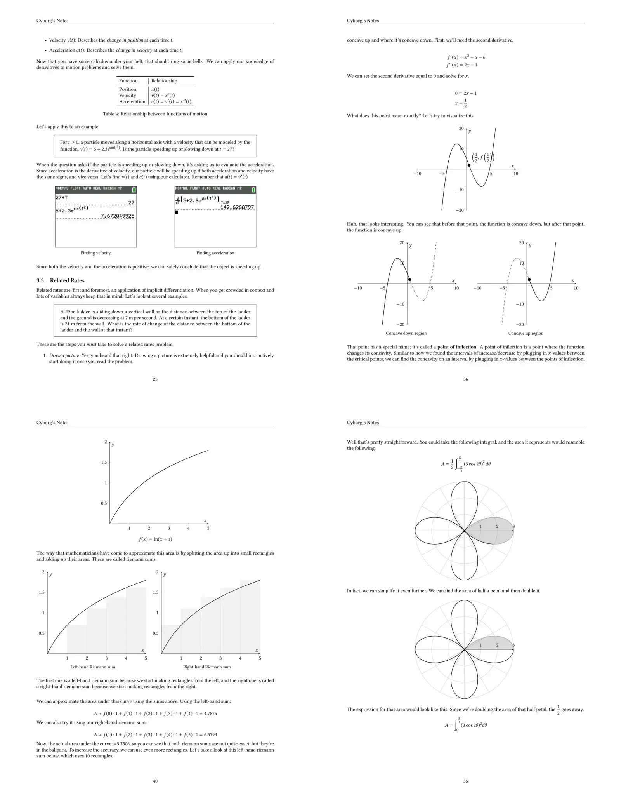
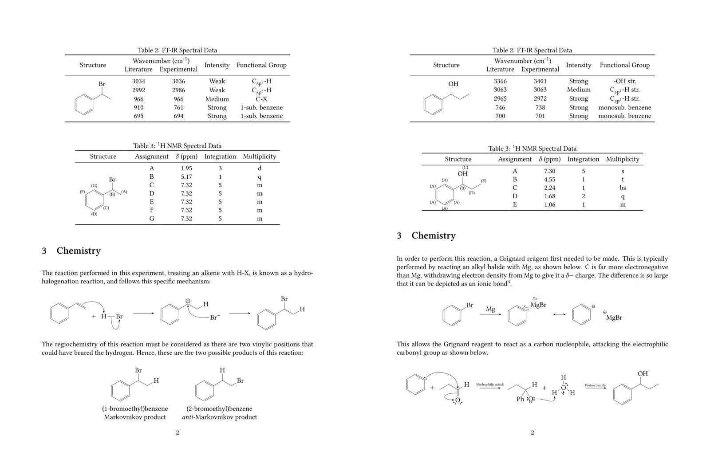
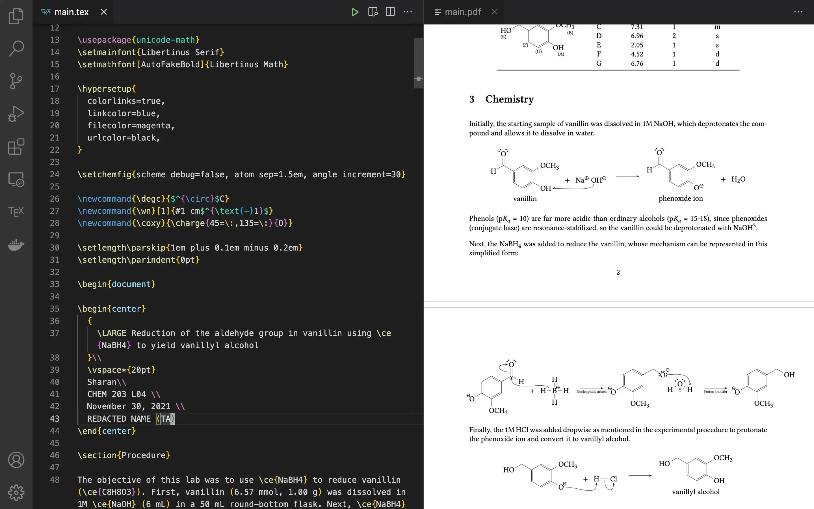

## Introduction to LaTeX

If you're unaware, LaTeX is a tool used by researchers and the academic community at large to typeset documents, presentations, math equations, and basically any content centered around technical and scientific communication.

It's a beefed up version of Word or Google Docs, but it's written using code in `.tex` files, which can be compiled into distributable formats such as PDF, epub, HTML, etc.

## How LaTeX works

This isn't meant to be a LaTeX tutorial, but this is the basic layout of a LaTeX document:

```tex
\documentclass{article}

% PREAMBLE
% Define formatting stuff here

\usepackage{amsmath}

\begin{document}

% YOUR MAIN CONTENT HERE

Lorem ipsum dolor sit amet

\[
  (a+b)^n
  =
  \sum_{r=0}^n \binom{n}{r} a^{n-r} b^r
\]

\end{document}
```

All of your document's content is defined within the document block, and its formatting is controlled from the preamble. LaTeX supports all the standard formatting/layout features such as headings, bold/italic/underlined text, bullet and numbered lists, headers and footers, image layouts, etc.

You can easily swap out the code in the preamble and change the entire layout of the LaTeX document, which is powerful for document authors. It also comes with a large package ecosystem that lets you do basically anything you'd like, from drawing beautiful plots and charts to chemical diagrams.

As you can imagine, LaTeX documents can get really large easily, due to both the long format of technical documents in general and the verbose nature of LaTeX syntax. Thus, you have the ability to split the large document into multiple files and import them in, stitching them together to form one coherent document. This is good to keep in mind... I once had a friend who wrote an [entire 220-page book](https://www.amazon.com/Bizarre-Oeuvre-Nihil-Libre/dp/B08L67F33X) in a single LaTeX file without knowing that this was possible.

## Showcase

This is just a small subset of the type of work you're able to do with LaTeX (Note: this is all my original work).

### Math notes

These are some calculus notes that I made in LaTeX. The sample shows random pages to showcase various LaTeX features rather than one coherent math topic. ([View PDF](files/subset.pdf))



### Reaction mechanisms (chemistry)

These are some reaction mechanisms I drew for an organic chemistry lab using the [`chemfig`](https://www.ctan.org/pkg/chemfig) package. Page 1 shows the electrophilic addition of HBr to styrene and Page 2 shows the reduction of propanal to 1-phenylpropan-1-ol using a Grignard reagent. ([View PDF](files/subset-chem.pdf))



## My very first LaTeX setup

When I was first learning how to use LaTeX, I wasn't too worried about getting the exact tooling that I wanted, and I feel like wasting time on that would have been a worthless pursuit. Thus, I was mostly rolling with [Overleaf](https://www.overleaf.com), which is, in many ways, the Google Docs of LaTeX. It's a lightweight, web-based editor which lets you use all the same packages and features as you would get with a local editor, without the cluttered, bloated UI offered by more traditional tools such as [TeXMaker](https://www.xm1math.net/texmaker/) or [TeXShop](https://en.wikipedia.org/wiki/TeXShop), which often come bundled with LaTeX installations.


When you're just starting out, anything works. It's more important, in my opinion, to get the hang of the syntax and learning to use its features rather than getting hung up over perfecting your setup. However, I would highly advise that you stay away from the large tools like the ones I mentioned earlier. At least when I personally tried TeXMaker, I felt like I was spending more time learning to use the toolbars and buttons and menu options than I was mastering the core LaTeX syntax and the like.

## Graduating to Visual Studio Code

Visual Studio Code is a stealthy, powerful code editor that many software developers swear by for almost all of their tasks. It slices, it dices, it does everything. I'd been using it for a few years by that point for various other things, but I soon found out that it has an amazing extension to work with LaTeX called [LaTeX Workshop](https://marketplace.visualstudio.com/items?itemName=James-Yu.latex-workshop), and I strongly feel that switching to VS Code brought my LaTeX workflow to a new high.



I absolutely loved this change as I was back in a familiar environment with better customizability than Overleaf, by a long shot. I had my Vim keybindings, IntelliSense for LaTeX macros, lookup and Go-to definition, and all the other great features that developers appreciate about VSC. This extension also played nicely with [XeLaTeX](https://www.overleaf.com/learn/latex/XeLaTeX), which is my LaTeX engine of choice, and it also has a build on save feature where your PDF is built and reloaded each time you save your file, and this just takes a few seconds to refresh on save.

Not to mention, Visual Studio Code also has the advantage of being local, so you can work on your LaTeX files anywhere, regardless of your internet connection. If you already use VSC for other tasks, it might be worthwhile to start using it as your LaTeX editor as well.

## Vim comes to the rescue

More recently, I started to switch to Vim for a ton of my programming/development use-cases. While it has a steep learning curve, Vim is an extremely versatile, terminal-based IDE that can be used for practically anything. And it just so happens that there's [`lervag/vimtex`](https://github.com/lervag/vimtex), an amazing Vim plugin that adds LaTeX support and also allows you to live preview your document with viewers such as Skim (on Mac) or zathura (cross-platform).

My inspiration for switching to Vim for LaTeX documents comes from two people on the internet: the first is [Gilles Castel](https://castel.dev), a PhD student at KU Leuven whose blog I discovered while procrastinating on my work one day (you know, the usual). His setup completely blew me away, and I immediately started looking through his dotfiles and figuring out what I could bring into my own workflow and adopt for my use case. While I don't follow his exact workflow (for example, I don't do my illustrations with Inkscape, which I don't really have a use for as a Microbiology student), I heavily borrowed ideas from his setup and blog.

The second inspiration I had for my setup was [u/ykonstant](https://reddit.com/u/ykonstant) on Reddit, who had shared [a video of their LaTeX workflow](https://www.reddit.com/r/unixporn/comments/jtjol5/cinnamon_latex_workflow_in_vim/) on a subreddit I used to follow. I was blown away by this setup as well, since I loved how minimalistic and decluttered their LaTeX code seemed. I feel like my own code (and that of many of my colleagues) can get extremely cluttered, especially when typesetting math equations (I think chemfig does a better job of organizing reaction mechanisms with their `\schemestart` and `\schemestop` syntax), so watching how they seemd to stay extremely organized while cranking out code at such a fast pace definitely left an impression on me.

Gilles's workflow and [this blog post of his in particular](https://castel.dev/post/lecture-notes-1/) taught me to make my own UltiSnips snippets for tasks like boilerplating the code for a `chemfig` reaction mechanism or a `pgfplots` plot. The reddit post inspired me to keep my LaTeX code clean and embrace the use of newlines to spread out code for math equations rather than writing it all out in one long line, which came in handy when I wrote out the [math notes](#math-notes). I also got the idea to use [`limelight.vim`](https://github.com/junegunn/limelight.vim) to grey out the rest of the document and focus in on the specific lines I was working on, which was a focal point of the reddit post as well.

If you're interested in my own LaTeX setup in vim, you can check out my screenshots and dotfiles [here](https://github.com/justsharan/dotfiles). While I haven't put my snippets and templates up there, it still has my vimtex config and a bunch of miscellaneous things I needed to get LaTeX to play nicely with Vim.

P.S. you can also use either Vim or VS Code as an alternative to RStudio... and VS code also works well for editing Jupyter notebooks. The more you know.
