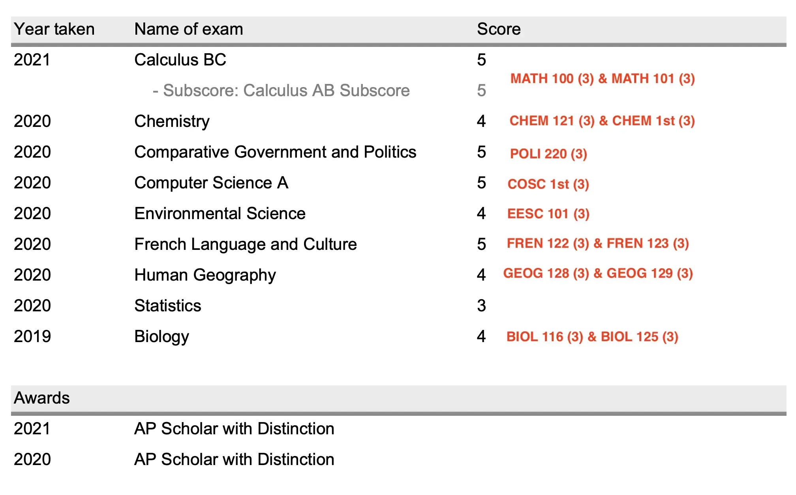

This is just an article laying out all of my first-year credits and how much money (and time) I've saved due to these credits.

## AP exams

This is my AP score report, showing each AP exam I've taken and the score I obtained on them. I've annotated each exam with the course corresponding credits I get at UBC. If you're unaware, AP exams are graded on a scale of 1-5, and UBC provides credit for AP scores of 4 or 5. You can check which specific courses you can get credit for [at this page](https://you.ubc.ca/applying-ubc/applied/first-year-credit-ok/).

What can I do with all of this? Having credit for a course means UBC basically pretends that you've taken those courses and understand the content for course registration purposes. This means that you can directly register for courses that require those as a prerequisite (ex: I took BIOL 205 my first year, since I have credit for BIOL 125, which is its prerequisite).

Since I'm a Microbiology major, [here are the requirements](http://www.calendar.ubc.ca/okanagan/index.cfm?tree=18,360,1102,1458) for my major at UBC Okanagan.

As you can see, I've already shaved off most of my coursework for first year. In the end, I'm just left with this... basically first-year english, physics, and half of chemistry.

- ENGL 109, or two of ENGL 112, 113, 114, 150, 151, 153, 154, 155, or 156
- PHYS 111
- PHYS 121
- CHEM 123

It doesn't stop at first-year courses, though. If you look at the higher year course requirements, you'll see that I need to take a total of 24 elective credits over the course of my degree. I can count my AP credits towards that, too. After I disregard all of the first year science courses, I'm left with credits for:

- CHEM 1st (3)
- POLI 220 (3)
- COSC 1st (3)
- EESC 101 (3)
- FREN 122 (3) and FREN 123 (3)
- GEOG 128 (3) and GEOG 129 (3)

That's exactly 24 credits. Just enough for my elective credit requirements.

## Community college classes

Since I took AP Chemistry in 11th grade, I had my score that summer, and I used it to enroll in Organic Chemistry I and II at my local community college ([RVCC](https://raritanval.edu)). That gave me credits for **CHEM 203** and **CHEM 204**.

## Total Count

In the end, these are all the courses/credits that I **don't** have to take:

- BIOL 116 (3) and BIOL 125 (3)
- CHEM 121 (3)
- MATH 100 (3) and MATH 101 (3)
- Second-year electives (6)
- Third/fourth-year electives (18)
- CHEM 203 (3) and CHEM 204 (3)

## Implications

That's a total of 45 credits of coursework that I won't need to take for my degree, which is a year and a half of coursework (a typical science student takes 30 credits during a year at UBC).

Does this mean I want to graduate early? No. While it would be great to be done with university early, I fear that I won't develop a strong enough foundation in the sciences with just 2-2.5 years of university. I want to use this "breathing room" to explore other options like minoring in Data Science or doing a co-op year to make my education more substantial.

As I soon realized, there's also huge financial savings that come with not having to take these courses. As of the time of writing, UBC charges int'l students CAD$1,413.19 for each credit taken ([Source](https://www.calendar.ubc.ca/okanagan/index.cfm?tree=14,339,1031,0)). 45 credits \* CAD$1,413.19 = **CAD$63,593.55**. That's a conservative estimate, since UBC even raises tuition by roughly 2% each year, so I'll be saving slightly more than that.

Converting to USD, that's **$50,354.78**. I've saved an extra $50,354.78 on my undergrad... that's pretty neat.

## Costs vs. Benefits

But those AP exams and college courses didn't come cheap, right? Yes and no. AP exams are [US$96/exam](https://apstudents.collegeboard.org/exam-policies-guidelines/exam-fees) in the United States, and my community college charged [US$168/credit](https://www.raritanval.edu/paying-for-college/tuition-and-fees), and each of my ochem courses were 5 credits.

Hence, I spent a total of 9 exams \* $96 = $864 on AP exams and 10 credits \* $168 = $1,680 on college courses. In the end, I spent **US$2,544** in prior coursework to save **US$50,354.78**. While each exam and college course felt like a huge sum to pay back when I was in high school, and my parents certainly questioned whether or not it would pay off, I look back with glee because of the massive "returns" I've made on my "investment".
