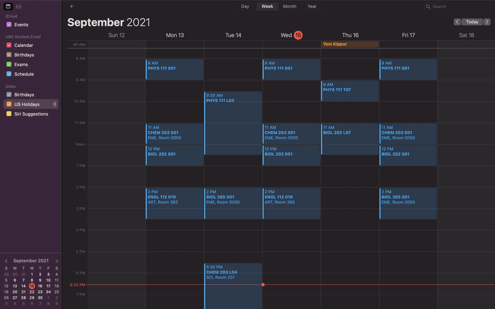

Okay... you know that feeling. You're super excited to rock your first year and enjoy uni, but as the year starts, assignments start piling up, and due dates come up left and right. The worst part is, it's even hard to keep track of _when_ assignments are due because professors can be disorganized or inconsistent, posting their due dates in messy word documents hidden deep within their Canvas sites, or having students use various sites to submit (may I take a second to say screw you to WileyPLUS, Turnitin, MyMathLab, Mastering, and all the other third-party tools... you guys deserve a special place in hell).

Well if that wasn't you, just know that this was the position I was in. My understanding of how all my courses were run was very... superficial. I thought I knew what was going on, when I was expected to complete each assignment, etc, but it was all fake. I would always be anxious about forgetting that a certain assignment even existed or mixing up its due date.

However, I decided to sit down one day and get my act together, and I feel a lot more confident about my expectations now. I just thought I'd share it here, in case there are others in my shoes as well.

## Keeping track of course times

Now, this wasn't that huge of a problem for me. I'd gotten good grades in high school, so I got one of the earlier registration times and managed to register for my ideal schedule. But, I still decided to add the schedule to my calendar app, and it looks like this:

## Keeping track of assignments

Oh, boy, was this hard. For the reasons I mentioned earlier, this was never really easy for me. However, I think I've reached a pretty good spot which works for now.

For this, I use Notion, which is an amazing organization-related app that definitely takes a while to get used to. I created a "Master Schedule" with every single assignment I need to do, from each class, for the whole semester.

Since this isn't very pretty to look at, I added a different view in my Notion dashboard that only shows the assignments for the upcoming week, so that it's more manageable.

Pretty sweet, eh?
