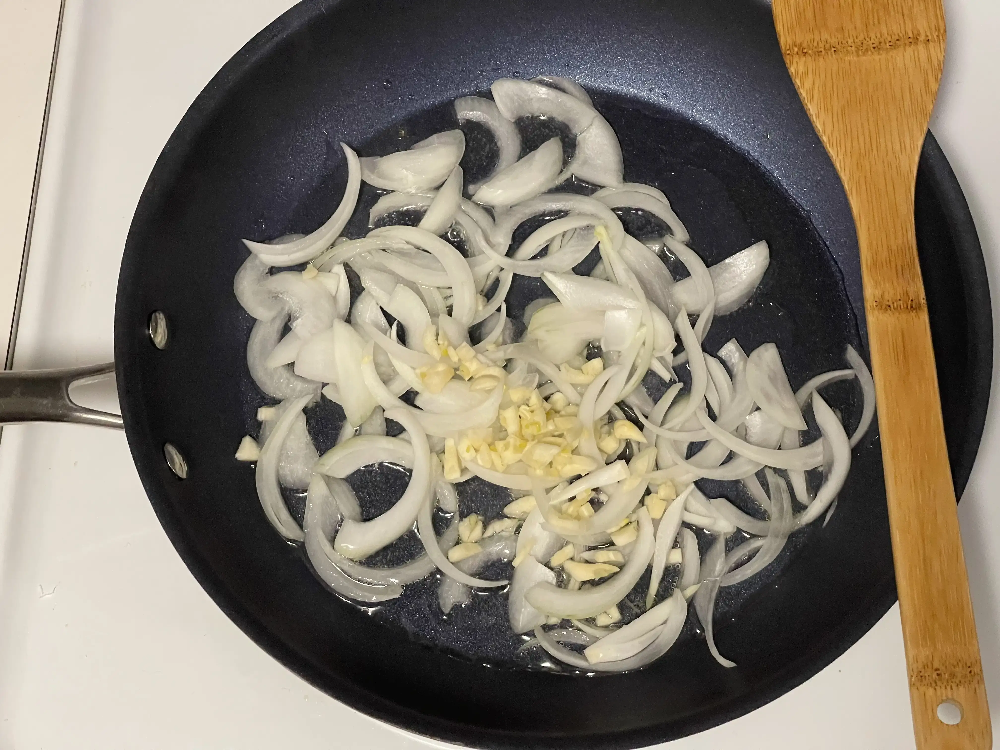
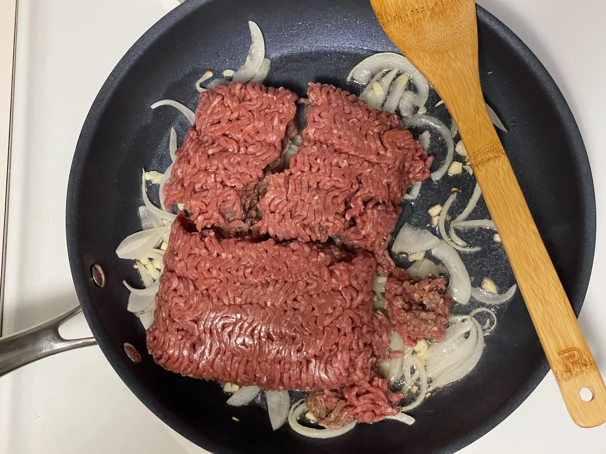
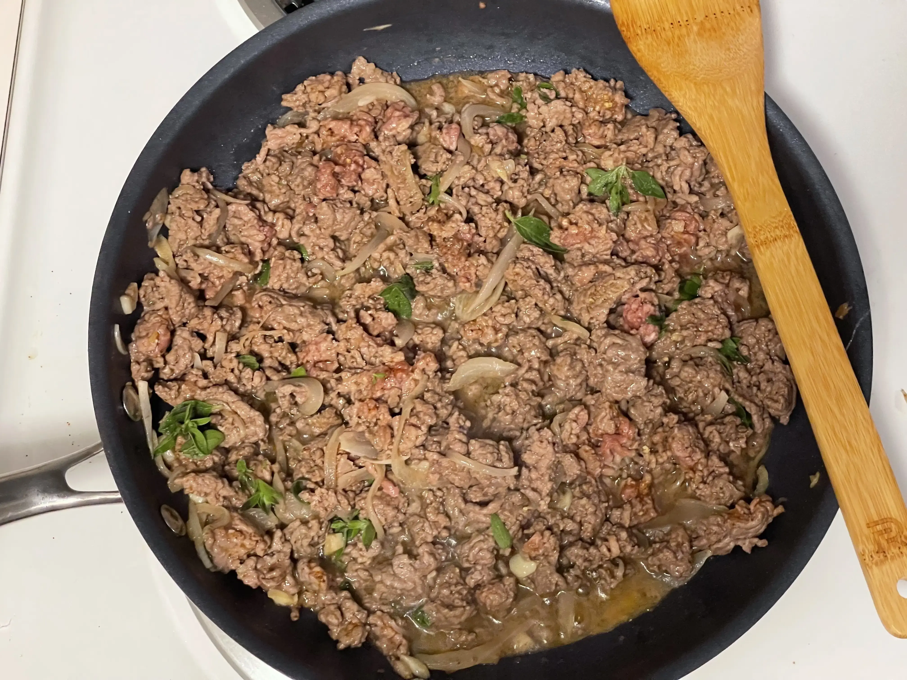
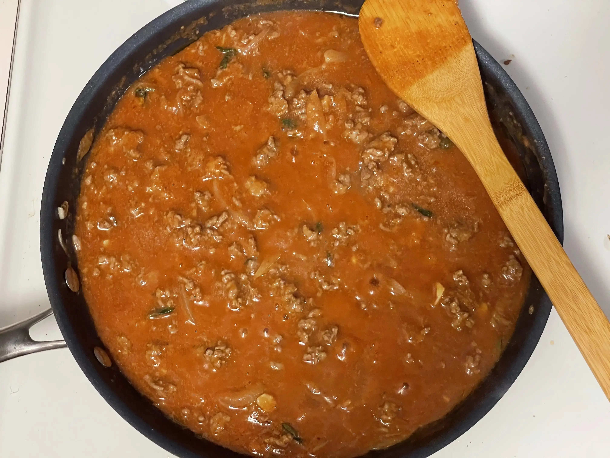
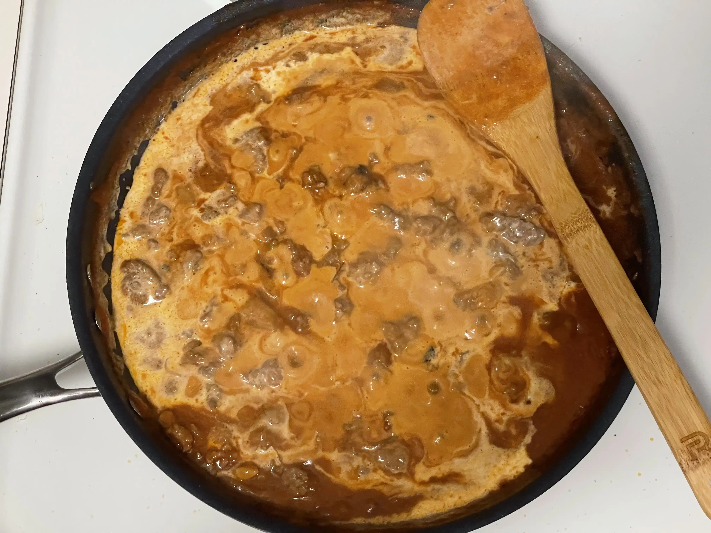
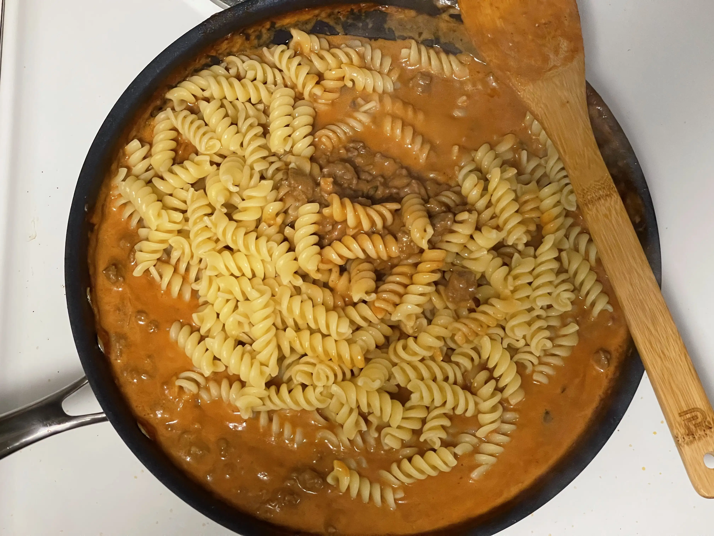

- ⏲️ Prep Time: 5 min
- 🍳 Cook time: 30 min
- 🍽️ Servings: 4

## Ingredients

- Basil (optional)
- Beef stock (or chicken stock), 1/2 cup
- Chili powder, 1 tbsp
- Crushed red peppers (optional)
- Flour, 2 tbsp (optional)
- Garlic, 3 cloves
- Ground Beef, 1.5 lb
- Heavy cream, 1/3 cup (optional)
- Olive oil, 2 tbsp
- Onion, 1
- Oregano, as needed
- Pepper
- Rotini pasta, 11 oz
- Salt
- Tomato sauce, about 14 fl. oz
- Worcestershire sauce, 1 tbsp (optional)

## Directions

1. Start a large non-stick pan on medium-high heat and add 2 tbsp of olive oil. You may use another oil if you'd like.

2. Once the pan is hot, toss in 1 sliced onion and 3 cloves of minced garlic. Allow it to cook until the onions are soft.

3. At this point, add in about 1.5 lbs of ground beef. Since I'm using heavy cream in this recipe, I went with lean ground beef to reduce the amount of fat. Shouldn't really matter too much.

4. Break it apart and allow it to cook. Also, add in some salt, pepper, chili powder, and oregano, mix it in. You can eyeball the measurements and use as much as you'd like.

5. After the beef has browned and reduced, add in most the 1/2 cup beef stock, tomato sauce, and 1 tbsp Worcestershire sauce and allow it to simmer on the pan. Also add in 2 tbsp of flour and thoroughly mix it in. This helps thicken the sauce.

6. Start boiling a pot of water for the pasta. You can go with any short-grain pasta, but I chose rotini. Once the pot is at a boil, sprinkle a pinch of salt and add in your pasta.

7. Add in 1/3 cup of heavy cream to the pan. You may swap this with half-and-half, but add a little more of it... like 1/2 cup (or regular milk, not recommended).

8. Once the pasta is _al dente_, strain it and add it to your dish. Toss and mix it in with the rest of the sauce. At this point, you might also wanna add some fresh basil leaves, if you'd like, and allow it to reduce with the rest of the dish.

9. Serve hot and garnish with crushed red peppers (optional).
