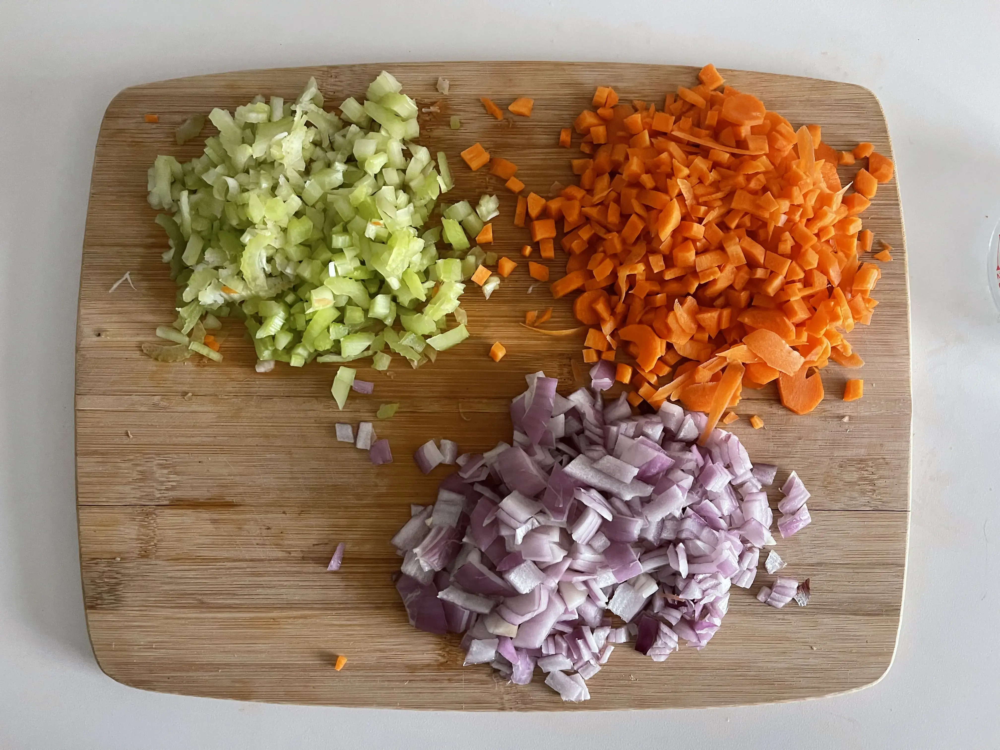
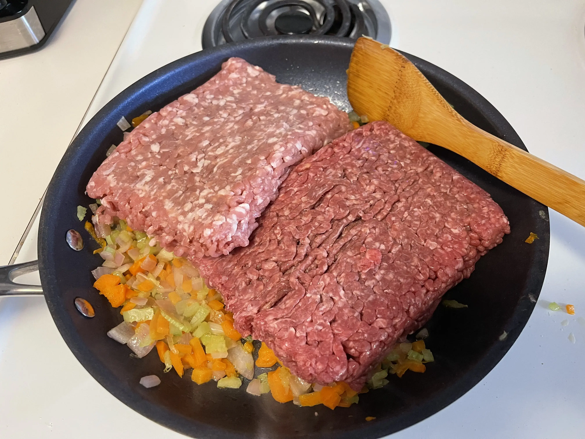
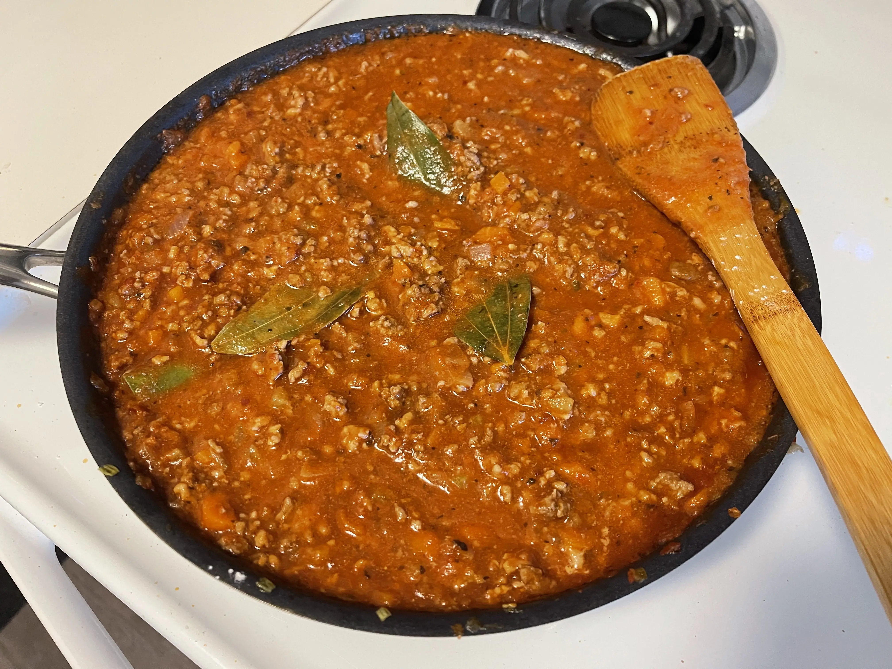

- ⏲️ Prep Time: 10 min
- 🍳 Cook time: 1 hr 30 min
- 🍽️ Servings: 8

## Ingredients

- Bay leaves (optional)
- Carrots (grated or minced), 1 cup
- Celery (minced), 1 cup
- Corn starch, 1 tbsp
- Crushed red peppers
- Ground beef (lean), 1 lb
- Ground pork, 1 lb
- Marinara sauce, 3 cup
- Milk, 1 cup
- Olive oil, 2 tbsp
- Onion (minced), 1 cup
- White wine, 1/2 cup

## Directions

1. Pour about 2 tbsp olive oil onto the skillet and then toss in your grated or minced carrots, minced celery, and minced onions. You can optionally put these through a food processor first, but I don't have one, so I've opted to grate/finely mince them instead. Cook them until they're tender and translucent.

2. Add the ground beef and ground pork. Break them up into tiny chunks and allow them to cook until they brown. Add in some salt, black pepper, and red pepper flakes now.

3. Once it's browned, add in 1/2 cup of white wine and allow the meat to absorb the flavors from the wine. A few minutes later, add in the marinara sauce, corn starch and milk, and mix to combine them all.

4. Once it's all homogenized, get it to boiling, and then turn it down to a low simmer so you still see bubbles every once in a while, but it's not cooking too fast. Allow it to simmer in this state for the next hour, stirring occasionally. I also added in some bay leaves before letting it simmer to give it more flavor.

5. Remove from heat and serve over your favorite kind of pasta, cooked according to the package instructions. You can refrigerate this for about 4 days or freeze it for 3 months.
