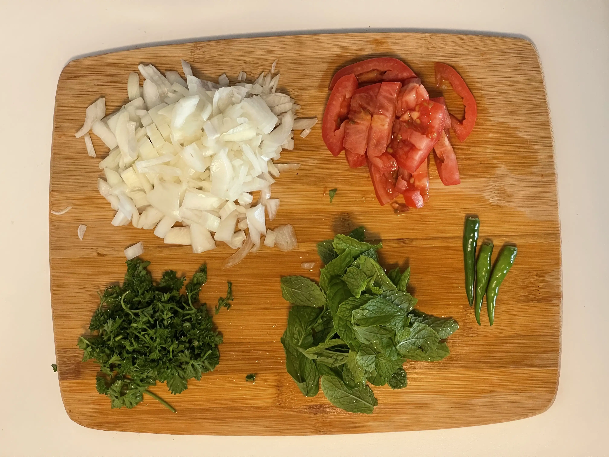
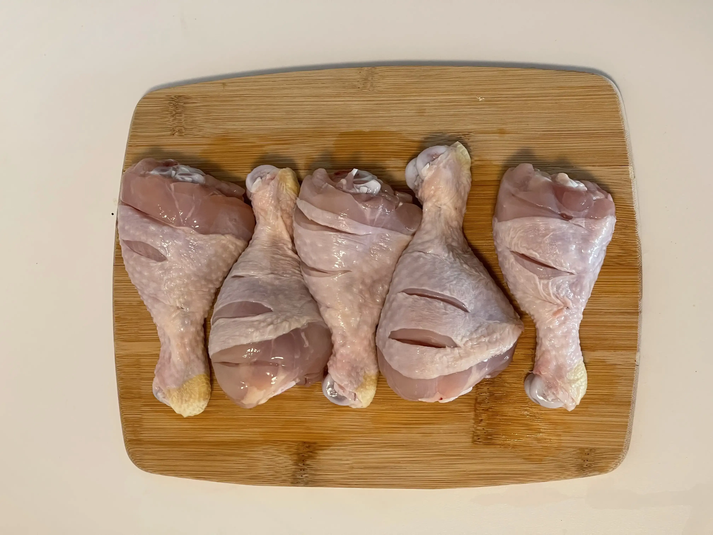
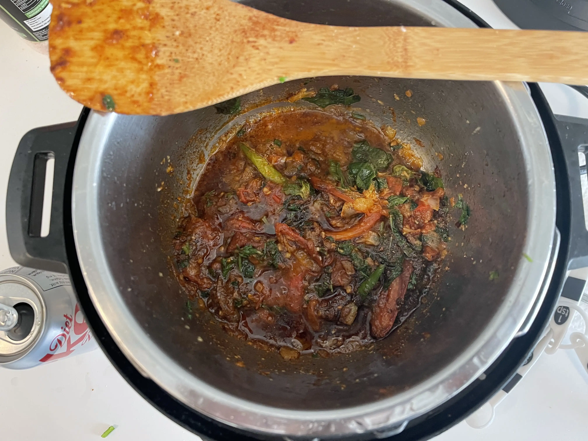
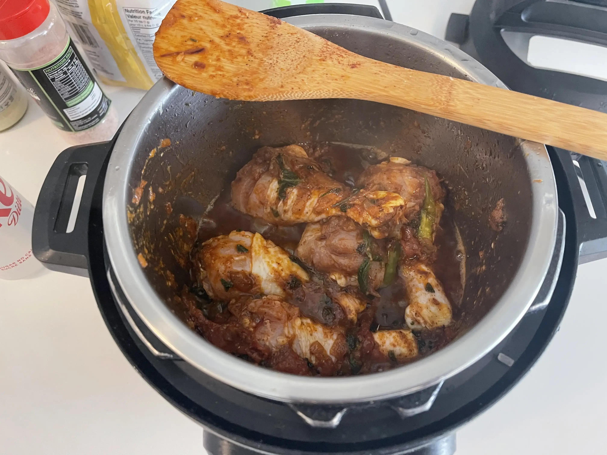
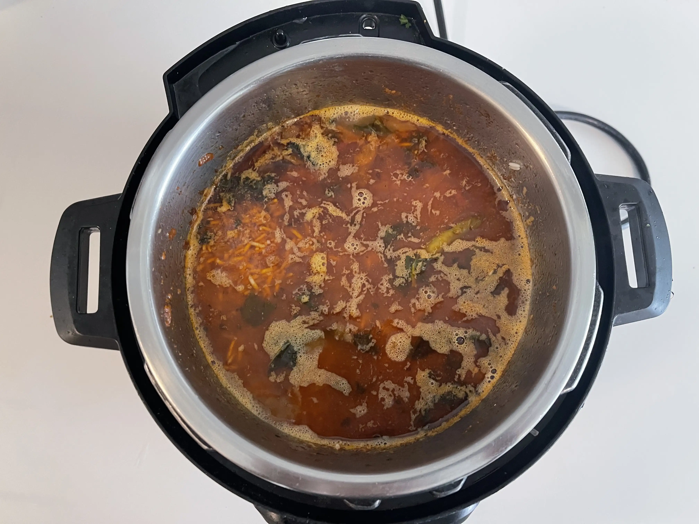

- ⏲️ Prep Time: 20 min
- 🍳 Cook time: 40 min
- 🍽️ Servings: 4

## Ingredients

- Basmati rice, 2 cups
- Canola oil, 1/4 cup
- Chicken drumsticks, 5
- Chili powder, 1 tbsp
- Cilantro
- Garam masala, 1 tsp
- Ginger garlic paste, 2 tbsp
- Green chilis, 3
- Lemon, 1
- Mint leaves
- Onion, 1
- Salt
- Tomato, 2

## Directions

1. First, measure out 2 cups of rice and wash and soak it in a bowl.

2. Next, prepare your veggies by slicing 1 onion, 2 tomatoes (only 1 shown in picture), some cilantro, and some mint leaves. Also, get 3 green chilis and cut off the head.

2. Next, wash and clean 5 chicken drumsticks, and add slits on the surface of the chicken leg as shown in the picture.

3. Now, set your instant pot to sauté mode for 30 minutes and pour in a quarter cup of canola oil. You can also add in the onions now. Allow it to cook.

4. Once the onions have reduced and browned, add in the chopped tomatoes, mint leaves, cilantro, and green chilis. Also add in all spices: chili powder, garam masala, ginger garlic paste, and 2 tbsp of salt. Sauté.

5. As the ingredients have reduced and homogenized, add in the chicken drumsticks. Mix everything around to ensure that all surfaces of the chicken are coated with the stuff already in the pot. Also squeeze in 1 lemon.

6. Allow it to cook for 7 minutes. Afterwards, add 3 cups of water to the pot and let it simmer.

7. Finally, drain the soaked rice and add it to the pot. Mix it around very gently to ensure that all the rice is underwater. Taste a bit of the broth to ensure that the spice levels are right and that it is slightly saltier than expected.

8. Pressure cook the pot for 5 minutes. After it is done, allow it to sit for 10 minutes and release the pressure manually afterwards. Serve hot.
