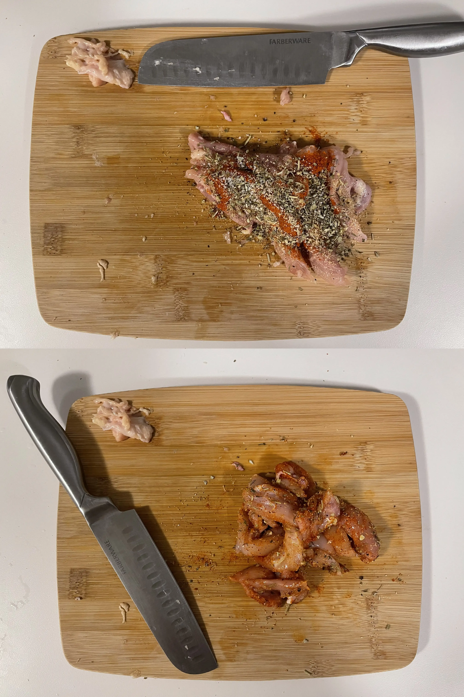

- ⏲️ Prep Time: 10 min
- 🍳 Cook time: 20 min
- 🍽️ Servings: 2

## Ingredients

- Boneless chicken thighs, 1
- Black beans, 200 mL
- Canola oil, 1 tbsp
- Dressing of your choice
- Garlic powder
- Italian seasoning
- Onions, 1/2
- Paprika
- Romaine lettuce, 1 head
- Tomato, 1/2
- Tortillas, 2

## Directions

1. I began by washing and cleaning 1 boneless chicken thigh and slicing it into thin strips, since this is the way I prefer them.

2. Season them with the seasonings of your choice. I listed the ones I used in the ingredients, but you can pretty much go with whatever you like. I season them right on the cutting board to minimize the number of dishes I have to wash.

3. Fire up a pan or skillet with some oil and sear the chicken strips. You should immediately start hearing the sound of the chicken cooking once you drop them onto the pan. If not, wait a bit longer next time.

4. Flip the chicken strips when they turn slightly white on the sides and the top. I've found that this is the point when the under-side has gotten a nice sear on it. Continue cooking the chicken for a few minutes.

5. While the chicken is cooking, prepare the veggies and other fillings of your choice. I find that it's best to use a little less filling than you think, since it becomes harder to fold the burrito properly with more filling inside.

6. Finally, it's time to assemble the burrito. Place all the fillings in a line, perpendicular to the direction you'll be folding the burrito in. This ensures that every bite will contain a bit of all the food inside (vs tasting all the lettuce in one bite, all the black beans in another, etc).

7. When you're folding it, make sure to pack the filling as compactly as possible to end up with a sturdy burrito. Here's a video of a person folding a three-pointer which shows the technique.

<iframe width="560" height="315" src="https://www.youtube-nocookie.com/embed/8Tao5qnWWRE" title="YouTube video player" frameborder="0" allow="accelerometer; autoplay; clipboard-write; encrypted-media; gyroscope; picture-in-picture" allowfullscreen></iframe>

8. You can heat up the folded burrito on a pan (without oil, butter, etc... just on the pan) to toast it a little and give you the color that you see in the first picture.
