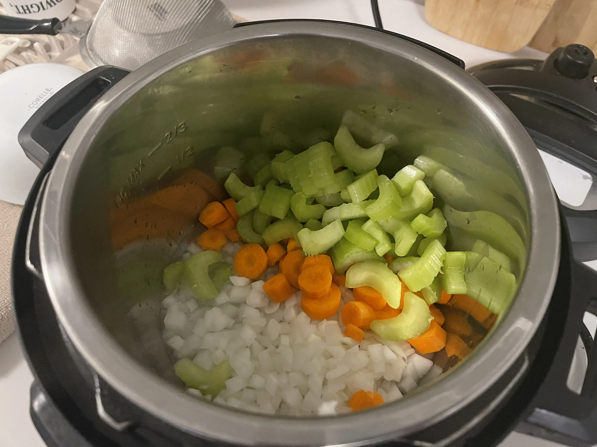

- ⏲️ Prep Time: 10 min
- 🍳 Cook time: 20 min
- 🍽️ Servings: 5

## Ingredients

- Canola oil, 2 tsp
- Carrots (diced), 3
- Celery (chopped), 2 stalks
- Chicken breast, 3
- Chicken stock, 5 cups
- Egg noodles, 5 cups
- Garlic (minced), 1 clove
- Italian seasoning, 2 tbsp
- Onion (diced), 1
- Pepper, 1 tsp
- Red pepper flakes, 2 tsp
- Salt, 1 tsp

## Directions

I apologize in advance; I didn't take many pictures while making this, mostly video. I tried to include the videos on this page but the page load size would be several megabytes, which wouldn't be fair to viewers on low-data connections.

1. First, prepare all your veggies. Then, heat up the instant pot on sauté mode and add canola oil and your veggies & garlic.

2. Cook them for 3-4 minutes until the veggies become tender. I also add my salt, pepper, and parsley in at this time. I've provided approximate amounts in the ingredients list, but just add them to taste.

3. Add in your chicken stock (see notes) and bring it to a simmer.

4. Turn off sauté mode and add in your chicken breast. Cook it on high pressure for 7-10 minutes (see notes). Once it's done, wait until the natural release is complete, or wait at least 10 minutes before releasing manually.

5. Fish out the chicken pieces from the instant pot and place in a separate plate/bowl. Use forks to shred the chicken apart into pieces and add it back in.

6. Add in cooked egg noodles or pasta and stir to mix everything. Serve hot. **Do not** cook your egg noodles directly in the soup unless you are serving all of the soup at that time.

## Notes

* **Type of chicken**: I used chicken breast in my recipe, but you can use any cut of chicken. Chicken breast just shreds into so many pieces (unlike thighs, legs, etc), so I feel like I'm getting a better bang for my buck using chicken breast, but you're free to use any cut.

* **Pressure cook time**: Story time. I usually buy a family pack of chicken breasts and freeze it in individual ziplock bags; this way, I can thaw as little or as much as I need throughout the week. For this recipe, I don't bother thawing my chicken the night before... instead, I take the breast directly out of the freezer and pop it into the instant pot at step 4. Since I'm cooking directly from frozen, I set the time for 10 minutes. If you're cooking from refrigerated/thawed chicken, I would advise cooking for a lower time (~7 mins oughta do it). If you're using rotisserie chicken (another pro tip... you can just buy it from the store and shred with a fork), then I'd advise pressure cooking for even less time or just adding the chicken after releasing. If your rotisserie chicken is cold (say you'd kept it in the fridge), then I'd turn on sauté mode and bring your soup to a simmer to heat it up.

* **Meal prep advice**: If you're preparing this recipe to save for multiple meals later, do not prepare/add in all the egg noodles on the first day. They will absorb all the water, and you'll be left with a mushy chicken noodle pasta. If you wanna use this to meal prep, then store the soup separately and cook the egg noodles fresh for every meal. Allow the soup to cool completely before freezing. It freezes well for up to 2 months.

Possible substitutions:

* Water + 2 chicken boullion cubes instead of chicken stock (this is what I personally do... super cheap and effective)
* Any kind of spiral pasta instead of egg noodles (rotini works best... you want a shape with a lot of surface area)
