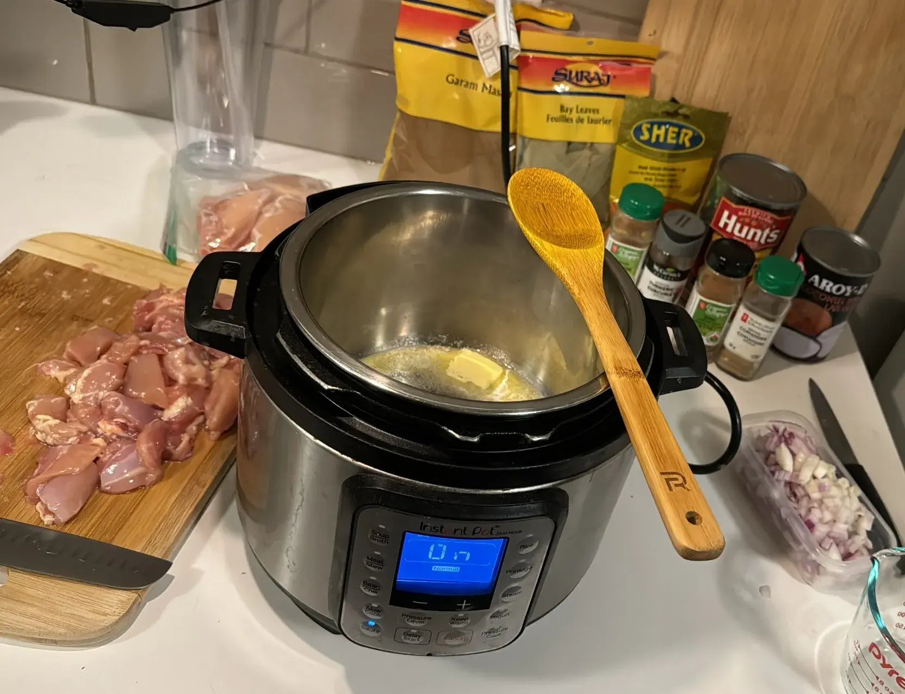

- ⏲️ Prep Time: 10 min
- 🍳 Cook time: 30 min
- 🍽️ Servings: 3

## Ingredients

- Chicken breast/thighs (cubed), 2 lbs
- Onions (diced), 1 medium
- Ginger, 1 tbsp
- Garlic, 4 cloves
- Butter, 2 tbsp
- Garam masala, 1 tbsp
- Chili powder, 1 tsp
- Turmeric powder, 1 tsp
- Salt, 1 tsp
- Kashmiri chili powder, 1 tsp
- Tomato sauce, 8 oz
- Coconut milk, 4 oz

## Directions

1. Cut chicken into cubes, dice your onion, and cut up ginger and garlic. You can swap the ginger and garlic for 1 tbsp of ginger-garlic paste, if you have it.

2. Set the instant pot to sauté mode and add in your butter.

3. Let the butter melt and then add the onions, garlic, and ginger. The traditional technique is to add the onions first, then add the garlic and ginger so they don't burn, but idgaf and I want my recipe to be easy to execute.

4. Add in all the spices and the cubed chicken. Mix to combine and let it cook and brown for 2-3 mins.

5. Add in the tomato sauce. Let it simmer for 2 mins and then pressure cook on high for 6 minutes.

6. Remove the lid and set it back to sauté mode. Add in the coconut milk and stir to combine.

7. Let it cook down to your desired consistency. Garnish with cilantro and serve hot over rice or naan bread with some fresh veggies on the side.

## Notes

Possible substitutions:
* Paprika for Kashmiri chili powder (won't be as colorful)
* Evaporated milk or condensed milk for coconut milk (consistency may vary)
* 2 tbsp ginger-garlic paste for ginger and garlic
* Equal parts water and tomato paste for tomato sauce (mix this in a separate bowl first and then add)
