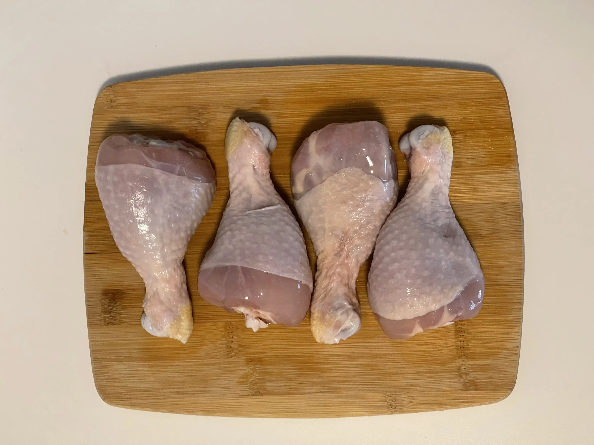
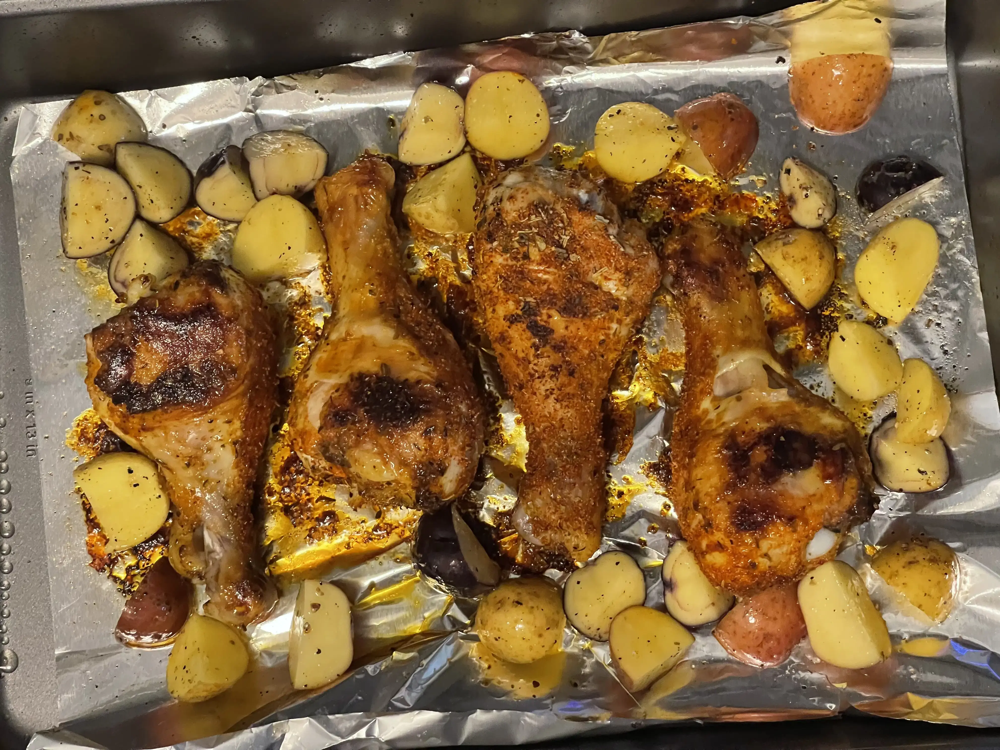

- ⏲️ Prep Time: 5 min
- 🍳 Cook time: 45 min
- 🍽️ Servings: 2

## Ingredients

- Chicken drumsticks, 4
- Paprika, 2 tsp
- Pepper
- Garlic powder, 1 tsp
- Italian seasoning, 1 tsp
- Olive oil, 2 tbsp
- Onion powder, 1 tsp
- Potatoes, as needed
- Salt

## Directions

1. Preheat your oven to 425° before you get started with preparing your chicken.

2. Wash and clean 4 chicken drumsticks and pat them dry. You may want to cut off any loose bits of skin with kitchen shears, but this is optional.

3. Assemble your spice mix. For this, I used a mix of paprika, garlic powder, onion powder, and italian seasoning, since that's what I had in my pantry and those are the flavors I wanted. Mix them together.

4. Transfer your chicken to a bowl and sprinkle on all the seasoning. Rub it around to make sure that all sides of your chicken are coated with some amount of it. Add in 1 tbsp olive oil and make sure that the chicken is coated with it as well.

5. Move your chicken to a baking tray lined with aluminum foil. Place it in the oven once it's finished pre-heating. Set your timer for 25 minutes.

6. While the chicken is cooking, prepare your potatoes by cutting them into slices. I used a bag of small, assorted potatoes, so I cut them into slices. If you're working with regular ones, I would cut them into wedges as that's the way I prefer them. Sprinkle on some pepper, salt, and 1 tbsp olive oil, and rub it around your potatoes.

7. Once the chicken has been cooking for 25 minutes, take out the tray and flip the chicken drumsticks. Next, add in your potatoes, making sure the skin side is facing up (a.k.a. **not** like this picture haha) to get some good color on them.

8. Place the tray back in the oven and allow it to cook for another 20 minutes. Serve hot with a garnish of cilantro and lime (optional).
