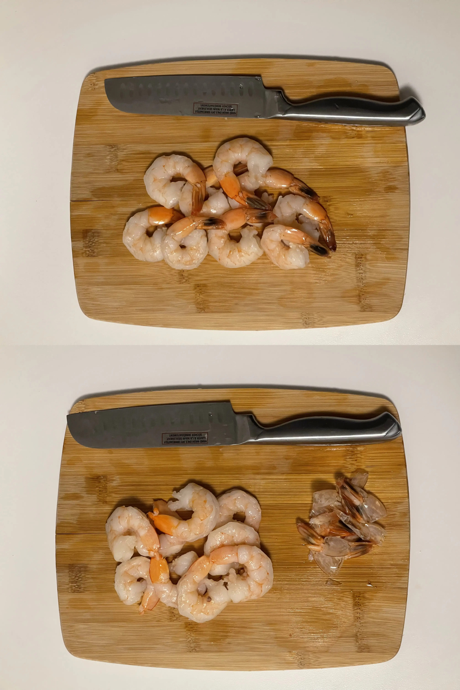

- ⏲️ Prep Time: 5 min
- 🍳 Cook time: 25 min
- 🍽️ Servings: 1

## Ingredients

- Canola oil, 1 tbsp (or olive oil, preferred)
- Minced garlic, 1 clove (optional)
- Pesto, 2 tbsp
- Salt
- Shrimp, 9 medium pieces (adjust as needed)
- Whole grain spaghettini

## Directions

1. I began by setting aside a pot of water to boil (to use for the spaghetti later). While that's going, I removed the tails from the shrimp and washed and cleaned them.

2. Next, I fired up a pan with some canola oil over medium heat and tossed in some minced garlic (totally optional) for flavor. Add the shrimp to the pan, and make sure to pat them dry before doing so.

3. Once the pot is boiling rapidly, sprinkle in a pinch of salt and as much spaghetti as you'd like to make, using the serving size as a guide. Cook according to the instructions on the box (mine called for it to sit in the boiling water for 7-9 minutes).

4. After roughly 5 minutes of cooking the shrimp, add a dollop of pesto and allow it to continue cooking.

5. Once the spaghetti is _al dente_, save a small amount of pasta water in a cup and strain the spaghetti over your sink. Add this spaghetti to the pan with the shrimp and pesto.

6. Incorporate the pesto, shrimp and spaghetti together using a spatula. Also, pour in the pasta water, which helps the pesto better stick to the pasta. Serve on a plate once cooked.
