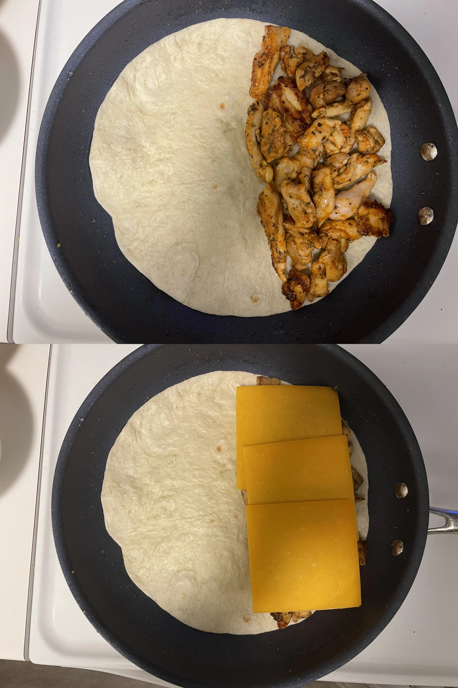

- ⏲️ Prep Time: 10 min
- 🍳 Cook time: 25 min
- 🍽️ Servings: 1

## Ingredients

- Boneless chicken thighs, 3
- Canola oil, 2 tbsp
- Cheddar cheese, 3 slices
- Garlic powder, 2 tbsp
- Italian seasoning, 1 tbsp
- Paprika, 2 tbsp
- Pepper
- Salt
- Tortilla, 1 (or as needed)

## Directions

1. Wash and clean your chicken thighs. Slice them into strips and season with the spices of your choice. I went with paprika, italian seasoning, and garlic powder, which has basically become my go-to spice mix for anything where I need "generic" chicken strips for use in recipes. Oh, add salt + pepper too.

2. Start up a non-stick skillet on medium-high heat with 2 tbsps of canola oil. Add chicken to the pan once hot.

3. Cook the chicken until it is white on the sides and then flip (this is enough time for it to get a good sear). Continue cooking for another couple minutes.

4. Remove all the chicken from the pan and save any residual oil in a jar for later use. There have been no pictures thus far as it's the same process as my [spicy chicken burritos](/recipes/chicken-burrito).

5. Lay a tortilla flat on the pan and add all of your chicken to one side. You can choose to split up your chicken among two quesadillas or make one loaded, filling one. I went with the latter to save time. Lay your cheddar slices on top.

6. Flip the other side to lay atop the cheese slices and allow it to cook. After the cheese has started to glisten and melt, flip the tortilla on the side.

7. Continue cooking until the cheese has entirely melted. You don't need to wait long here as the chicken has already cooked. The entire reason behind cooking it now is to brown the other side of the tortilla and melt the cheese (allowing it to hold the quesadilla together). If you believe that you've got the color and melted-ness that you want, you can take it off.

8. Once it has cooked, cut it in half down the middle and serve hot with a sauce of your choosing. I just used a tangy mint sauce I found at the grocery store (the same one I used for the [spicy chicken burritos](https://justsharan.xyz/recipes/chicken-burrito)).
