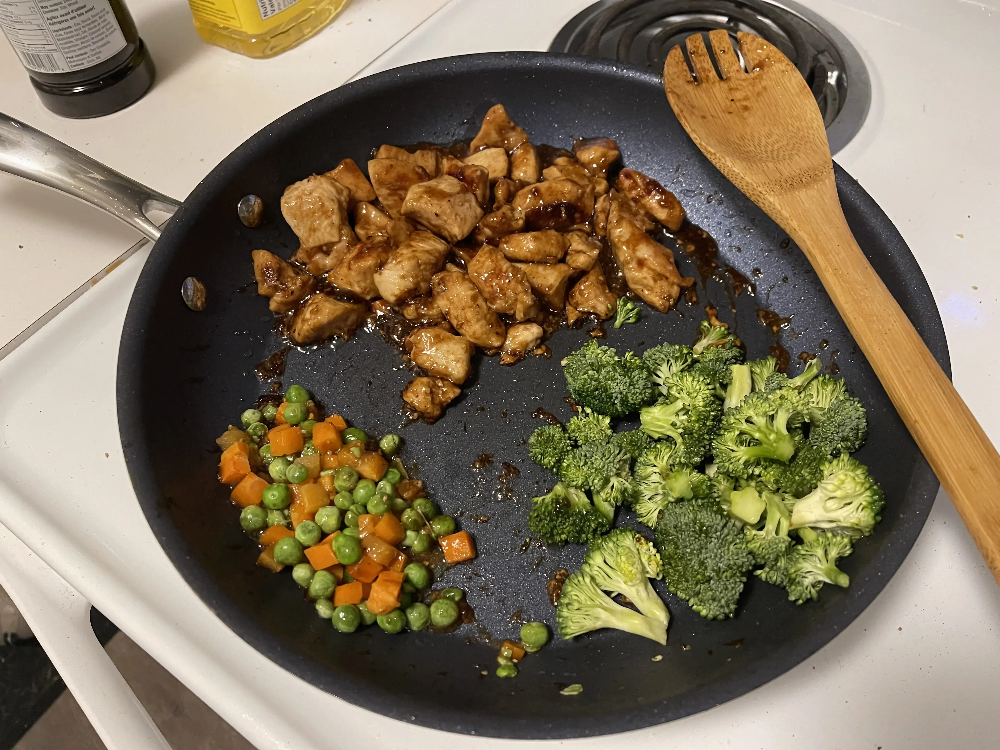

- ⏲️ Prep Time: 10 min
- 🍳 Cook time: 30 min
- 🍽️ Servings: 3

## Ingredients

- Broccoli florets
- Chicken breasts (2)
- Chow mein noodles
- Frozen carrots & peas
- Pepper
- Salt
- Teriyaki sauce

## Directions

1. Prepare chow mein noodles according to the instructions in the back of the packet.

2. Cut your chicken breasts into cubes and season with salt and pepper. Cook them on a pan with 2 tbsp olive oil. Once they're about halfway done, add some store-bought teriyaki sauce.

3. Once they're cooked, move them to the side and add in your frozen peas and carrots directly to the pan and allow them to warm up and cook. Later, add your broccoli florets to the pan and allow them to cook.

4. Once they're almost cooked, combine the chicken, peas, carrots, and broccoli florets. Add in the chow mein noodles that you cooked earlier and toss them together under low heat. Serve hot.

